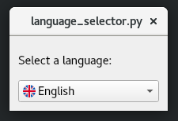
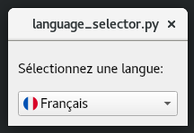
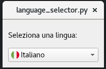
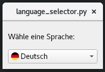

#  Language Selector Demo

The Language Selector Demo is a Python 3 application that showcases the use of the PyQt5 framework for creating a graphical user interface (GUI) with a QComboBox widget. 
The demo includes a list of languages represented by flags and allows the user to select a language to translate the UI text. 
The translations are loaded from Qt Linguist translation files and the text is updated dynamically based on the user's selection. 
This demo illustrates the use of QTranslator and QCoreApplication.translate to provide multi-language support for PyQt5 applications.

The purpose of this demo is to demonstrate the capabilities of the PyQt5 framework and how it can be used to create multi-language applications with ease. 
It also serves as a starting point for developers who want to implement multi-language support in their PyQt5 applications. 
The code is provided as a simple and easy-to-understand example that can be used as a reference for creating more complex applications.

## Language Selector GUI

